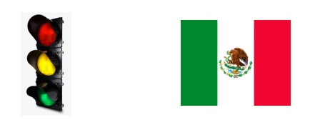
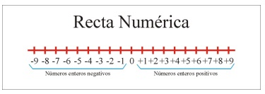
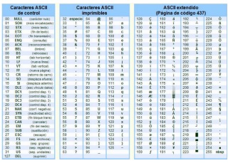
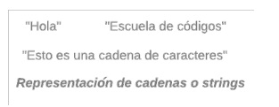
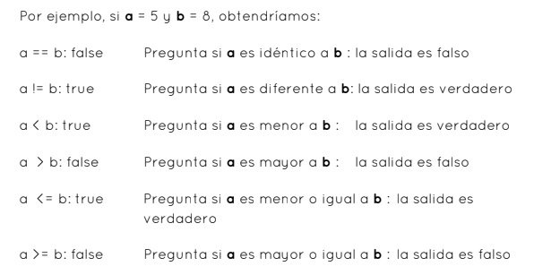
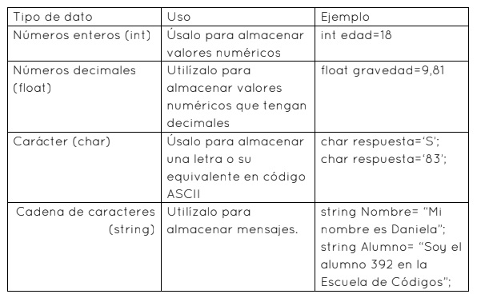

# TIPOS DE DATOS
Dato: es un hecho que se representa en la computadora. 

Ejemplo: el color rojo es un hecho y dependiendo del contexto puede representar algo.

En el contexto de las reglas de tránsito el color rojo representa alto, y en
el contexto de los símbolos patrios este color está asociado con la sangre
de los héroes que nos dieron patria.
La computadora sólo puede representar números en su memoria dentro
de sus circuitos, y para el dato color rojo puede asignarle un número
entero por ejemplo el número 4.

Un dato primitivo es una abstracción del mundo real (como por ejemplo
un número entero, carácter, un valor lógico, etc.), los cuales pueden ser
representados internamente por la computadora. Son "primitivos" en el
sentido que no pueden descomponerse en componentes más simples.
Desde estos tipos básicos puede definir datos compuestos.

## DATOS NUMERICOS
Los datos numéricos abarca tanto los datos denominados de tipo entero
y los de tipo punto flotante o reales.

Un dato de tipo entero es un subconjunto finito de los números enteros
cuyo tamaño depende del lenguaje de programación y de la computadora
utilizada.

Un dato de tipo real es un subconjunto finito de los números reales. Un
número real consta de un entero y una parte decimal y pueden ser
positivos o negativos incluyendo el cero.

## DATO DE TIPO CARACTER

Un dato de tipo carácter es la unidad básica e indivisible de lo que
llamaremos por el momento “una cadena”, también suele ser llamado
símbolo, como puede ser: a, @, #, 1, etc. Cada carácter es representado
por un conjunto de bits. Los caracteres suelen conformar conjuntos tales
como el código ASCII o el UNICODE.

## DATO DE TIPO CADENA O STRING
El dato de tipo cadena o string, es un tipo de dato compuesto debido a
que consiste de una serie finita de (datos tipo) caracteres que se
encuentran delimitados, dependiendo del lenguaje de programación, por
espacios en blanco y por una comilla (‘) o doble comillas (“).

## DATO DE TIPO LOGICO O BELEANO
Los datos de tipo lógicos o Booleanos (falso, verdadero) están formados
por dos valores que son falso (false) y verdadero (true).

La siguiente tabla resume los tipos de datos:

